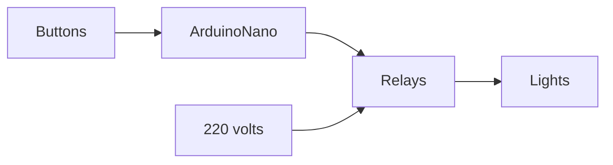

# smart-switches
Relays control to turn the lights on or off in my house.

```mermaid
flowchart LR
Switches[Buttons] --> Arduino[ArduinoNano]
Arduino --> Relays[Relays]
Power[220 volts] --> Relays
Relays --> Lights[Lights]
```
