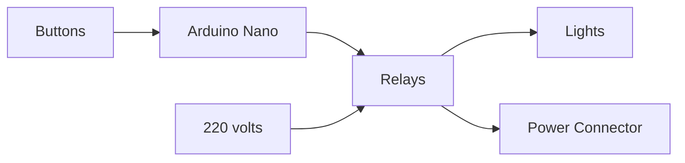

# smart-switches
Relays control to turn the lights on or off in my house.

This is the first automation project for my home. It will be extended to support motion sensors and other features.

## What's so "smart" about this project?
I can reasign the function of any button. One single button could light more than one lamp, or a power connector could be activated from more than one buttons whithout permanent wiring changes

10 buttons (pins 2-11 as inputs with pullup), 8 relays (pins 12-19 as outputs). 

## What I learned from this project:
- Write code and upload it to the microcontroller.
- Work with 220 volt inputs to light lamps or activate power connectors.
- Basic electronic.
- The Debounce concept and how to handle it: https://www.arduino.cc/en/Tutorial/BuiltInExamples/Debounce/

Demo video:

